title: Parallelism in Numerical Python Libraries
use_katex: False
class: title-slide

# Parallelism in Numerical Python Libraries

.larger[Thomas J. Fan]<br>

@thomasjpfan<br>

<a href="https://www.github.com/thomasjpfan" target="_blank"><span class="icon icon-github icon-left"></span></a>
<a href="https://www.twitter.com/thomasjpfan" target="_blank"><span class="icon icon-twitter"></span></a>


<a class="this-talk-link", href="https://github.com/thomasjpfan/pydata-nyc-2022-parallelism" target="_blank">
This talk on Github: github.com/thomasjpfan/pydata-nyc-2022-parallelism</a>

---

# Parallelism?

.g[
.g-4[

]
.g-4[

]
.g-4[

]

]

---

# Overview

.g[
.g-6.center[
## Configuration

]
.g-6.center[
## Implementation

]
]

---


# NumPy Parallelism 🚀


---

class: chapter-slide

# Demo: `np.add` vs `@` (matmul) 🧪

---

# Questions 🤔

- When is NumPy parallel?
- How is `linalg` implemented?
- How to configure parallelism for `linalg`?
- Can we parallelize `np.add`?

---

# When is NumPy parallel?

.center[
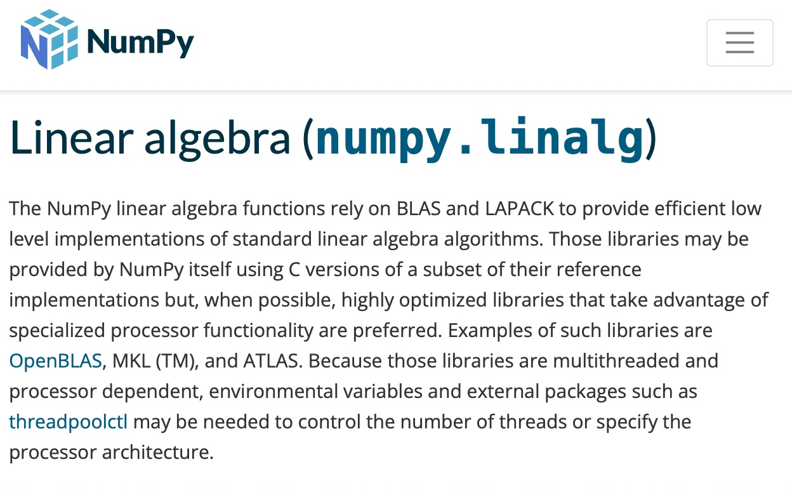
]

### https://numpy.org/doc/stable/reference/routines.linalg.html

---

#  How is `linalg` implemented?

.center[
## BLAS (Basic Linear Algebra Subprograms)
## LAPACK (Linear Algebra PACKage)
]

.g.g-middle[
.g-6[
- **OpenBLAS**
- **MKL**: Intel's Math Kernel Library
- **BLIS**: BLAS-like Library Instantiation Software
]
.g-6[

]
]

.footnote-back[
[Source](https://netlib.org/blas/)
]

---

class: top, top-5

# Which BLAS is my library using?

--

## Use `threadpoolctl`!

```bash
python -m threadpoolctl -i numpy
```

--

## Output for `OpenBLAS`:

```json
{
    "user_api": "blas",
*   "internal_api": "openblas",
    "prefix": "libopenblas",
    "filepath": "...",
    "version": "0.3.21",
*   "threading_layer": "pthreads",
    "architecture": "Zen",
*   "num_threads": 32
}
```

---

class: top, top-5

# Which BLAS is my library using?

## Output for `MKL`:

```json
{
    "user_api": "blas",
*   "internal_api": "mkl",
    "prefix": "libmkl_rt",
    "filepath": "...",
    "version": "2022.1-Product",
*   "threading_layer": "intel",
    "num_threads": 16
}
```

---

# How select BLAS implementation?

.g.g-middle[
.g-6[
## PyPI
### Only `OpenBLAS` (with `pthreads`)
]
.g-6[
## Conda-forge
```
conda install "libblas=*=*mkl"
conda install "libblas=*=*openblas"
conda install "libblas=*=*blis"
conda install "libblas=*=*accelerate"
conda install "libblas=*=*netlib"
```

[Read more here](https://conda-forge.org/docs/maintainer/knowledge_base.html#switching-blas-implementation)
]
]

---

# How to configure parallelism for `@`?
## Environment variables
## `threadpoolctl`

---

# Controlling Parallelism with environment variables

- `OPENBLAS_NUM_THREADS` (With `pthreads`)
- `MKL_NUM_THREADS` (Intel's MKL)
- `OMP_NUM_THREADS` (OpenMP)
- `BLIS_NUM_THREADS`

---

class: top, top-10

# `threadpoolctl`

## Context manager

```python
from threadpoolctl import threadpool_limits

with threadpool_limits(limits=4, user_api="blas"):
    Z = X @ Y
```

--

## Globally

```python
threadpool_limits(limits=4, user_api="blas")
```

---

# Can we parallelize `np.add`?

.g.g-middle[
.g-4[

]
.g-4[

]
.g-4[

]
]

---

class: chapter-slide

# Demo: Parallel `add`! 🧪

---

# Pytorch CPU Parallelism 🚀
## Parallel by default!

.g.g-middle[
.g-8[
## Configuration
- `OMP_NUM_THREADS` or `MKL_NUM_THREADS`
- `torch.set_num_threads`
]
.g-4[

]
]

---

class: center

# SciPy Parallelism 🚀


---

# SciPy Parallelism 🚀

.g.g-middle[
.g-8[
## `scipy.linalg`
## Python's Multiprocessing
## Python's Multithreading
## Custom C++ thread pool using pthreads
]
.g-4[

]
]

---

# `scipy.linalg`

.center[
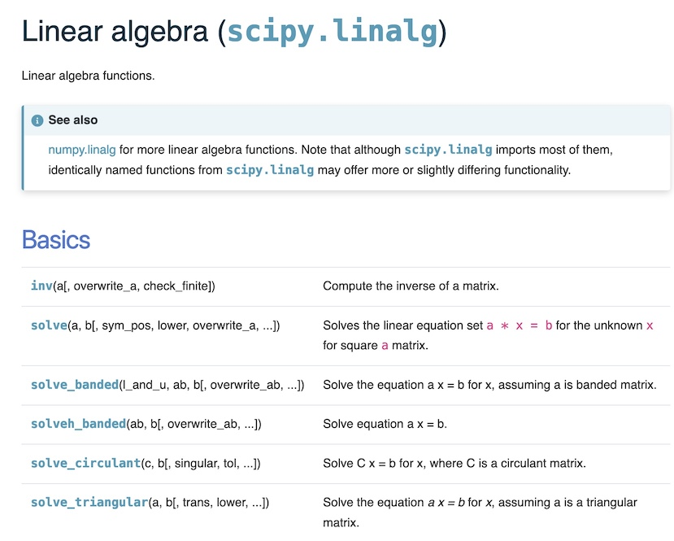
]

https://docs.scipy.org/doc/scipy/reference/linalg.html

---

# SciPy: Multiprocessing 🚀

Config with the `workers` parameter

- `integrate.quad_vec`
- `optimize.differential_evolution`
- `optimize.brute`
- `stats.multiscale_graphcorr`

---

# SciPy: `optimize.brute`

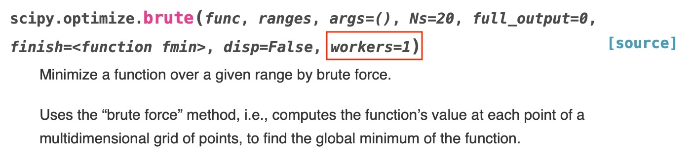

[Source](https://docs.scipy.org/doc/scipy/reference/generated/scipy.optimize.brute.html)

---

# SciPy: Multithreading 🚀

Config with the `workers` parameter

- `spatial.KDTree.query`
- `spatial.cKDTree.query`
- `spatial.KDTree.query_ball_point`
- `spatial.cKDTree.query_ball_point`

---

# SciPy: `spatial.KDTree.query`

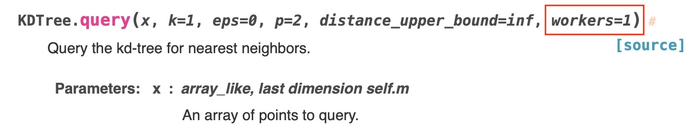

[Source](https://docs.scipy.org/doc/scipy/reference/generated/scipy.spatial.KDTree.query.html)

---

class: top, top-10

# Multiprocessing vs Multithreading

.g[
.g-6[
## Multiprocessing
- Likely need to think about memory
- Different [start methods](https://docs.python.org/3/library/multiprocessing.html#contexts-and-start-methods):
    - **spawn** (Default on Windows and macOS)
    - **fork** (Default on Unix)
    - **forkserver**
]
.g-6[
## Multithreading
- Need to think about the Global Interpreter Lock (**GIL**)
- Shared memory
- Spawning threads is faster
]
]

---

# SciPy: Custom C++ thread pool using `pthreads`

.g.g-middle[
.g-6[
Config with the `workers` parameter

- `scipy.fft`
- `linalg.matmul_toeplitz`
]
.g-6.g-center[

]
]

---

# SciPy: `scipy.fft.fft`

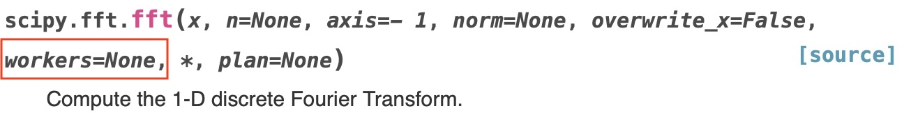

[Source](https://docs.scipy.org/doc/scipy/reference/generated/scipy.fft.fft.html)

---

# Why `pthreads` and not `OpenMP`? 🧵

- GNU OpenMP runtime library **does not work well** with `multiprocessing`
- Some OpenMP runtime libraries are **not compatible** with each other

Read more [in this SciPy issue](https://github.com/scipy/scipy/issues/10239#issuecomment-795030817).

---

# Parallelism in Pandas 🚀


---

class: top, top-10

# Parallelism in Pandas 🚀

.g.g-middle[
.g-8[
- Configure with `engine="numba"`
- Aggregations with `groupby`, `rolling`

- Parallel over columns in **DataFrames**:
    - `engine_kwargs={"parallel": True}`
]
.g-4[

]
]

---

class: chapter-slide

# Demo: Pandas Parallelism 🐼

---

# UMAP
## **Parallel by default** with Numba


[Source](https://umap-learn.readthedocs.io/en/latest/index.html)

---

class: top

# Parallelism with Numba

.g.g-middle[
.g-8[
## Configuration
- Environment variable: `NUMBA_NUM_THREADS`
- Python API: `numba.set_num_threads`
]
.g-4[

]
]

--

## Threading layers
- Open Multi-Processing (OpenMP)
- Intel Threading Building Blocks (TBB)
- workqueue (Numba's custom threadpool using `pthreads`)

---

# Parallelism with Numba

## Considerations
- Need to be careful when combined with Python's parallel libraries:
    - `multithreading`
    - `multiprocessing` **spawn**
    - `multiprocessing` **fork**
    - `multiprocessing` **forkserver**

- [Read more here](https://numba.pydata.org/numba-doc/latest/user/threading-layer.html)

---

# AOT vs Numba

.g[
.g-6[

.center[
## AOT
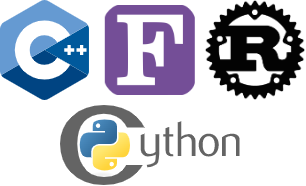
]

- **Ahead of time** compiled
- Harder to build
- Less requirements during runtime
]
.g-6[

.center[
## Numba

]

- **Just in time** compiled
- Source code is Python
- Requires compiler at runtime
]
]

---

# Parallelism in polars 🐻‍❄️


- **Parallel by default**
- Uses `pthreads` with rust library: `rayon-rs/rayon`
- Environment variable: `POLARS_MAX_THREADS`

[github.com/pola-rs/polars](https://github.com/pola-rs/polars)

---

class: center

# Parallelism in scikit-learn  🖥


---

# Parallelism in scikit-learn  🖥

.g.g-middle[
.g-8[
- Python Multithreading
- Python Multiprocessing (with `loky` backend)
- OpenMP routines (**Parallel by default**)
- Inherits `linalg` BLAS semantics from NumPy and SciPy (**Parallel by default**)
]
.g-4[

]
]

---

class: top, top-5

# Parallelism in scikit-learn  🖥
## Python Multithreading

--

- `RandomForestClassifier` and `RandomForestRegressor`
- LogisticRegression with `solver="sag"` or `"saga"`
- Method calls to `kneighbors` or `radius_neighbors`

--

## Configuration
- `n_jobs` parameter

```python
forest = RandomForestClassifier(n_jobs=4)
```

---

class: top, top-5

# Parallelism in scikit-learn  🖥
## Python Multiprocessing

- `HalvingGridSearchCV` and `HalvingRandomSearchCV`
- `MultiOutputClassifier`, etc

--

## Configuration
- `n_jobs` parameter

```python
from sklearn.experimental import enable_halving_search_cv
from sklearn.model_selection import HalvingRandomSearchCV

*halving = HalvingGridSearchCV(..., n_jobs=4)
```

---

.g.g-middle[
.g-8[
# loky
- Detects worker process failures
- Reuse existing pools
- Processes are spawned by default
]
.g-4[

]
]

Learn more at [loky.readthedocs.io/en/stable/](https://loky.readthedocs.io/en/stable/)

---

# Python Multiprocessing: Memory

<br>


---

# Parallelism in scikit-learn  🖥
## Python Multiprocessing: memmapping


---

class: top

# Parallelism in scikit-learn  🖥
## OpenMP

- **Parallel by default**

--

- `HistGradientBoostingRegressor` and `HistGradientBoostingClassifier`

--

- Routines that use pairwise distances reductions:
    - `metrics.pairwise_distances_argmin`
    - `manifold.TSNE`
    - `neighbors.KNeighborsClassifier` and `neighbors.KNeighborsRegressor`
    - [See here for more](https://scikit-learn.org/stable/auto_examples/release_highlights/plot_release_highlights_1_1_0.html#performance-improvements)

--

## Configuration
- `OMP_NUM_THREADS`
- `threadpoolctl`

---

# Scikit-learn Avoiding Oversubscription  🖥

.g.g-middle[
.g-8[
- Automatically configures native threads to **`cpu_count() // n_jobs`**
- Learn more in [joblib's docs](https://joblib.readthedocs.io/en/latest/parallel.html#avoiding-over-subscription-of-cpu-resources)
]
.g-4[

]
]

---

class: top-5, top

# Scikit-learn Avoiding Oversubscription Example

```python
from sklearn.experimental import enable_halving_search_cv
from sklearn.model_selection import HalvingGridSearchCV
from sklearn.ensemble import HistGradientBoostingClassifier

*clf = HistGradientBoostingClassifier()  # OpenMP
gsh = HalvingGridSearchCV(
    estimator=clf, param_grid=param_grid,
*   n_jobs=n_jobs  # loky
)
```

--

## Timing the search ⏰

```python
%%time
gsh.fit(X, y)
# CPU times: user 15min 57s, sys: 791 ms, total: 15min 58s
*# Wall time: 41.4 s
```

---

# Timing results
<!--
| n_jobs | OMP_NUM_THREADS | duration (sec)  |
|--------|-----------------|-----------------|
| 1      | unset           | 42              |
| 1      | 1               | 74              |
| 1      | 16              | 42              |
| 16     | unset           | 8               |
| 16     | 1               | 8               |
| 16     | 16              | over 600        | -->

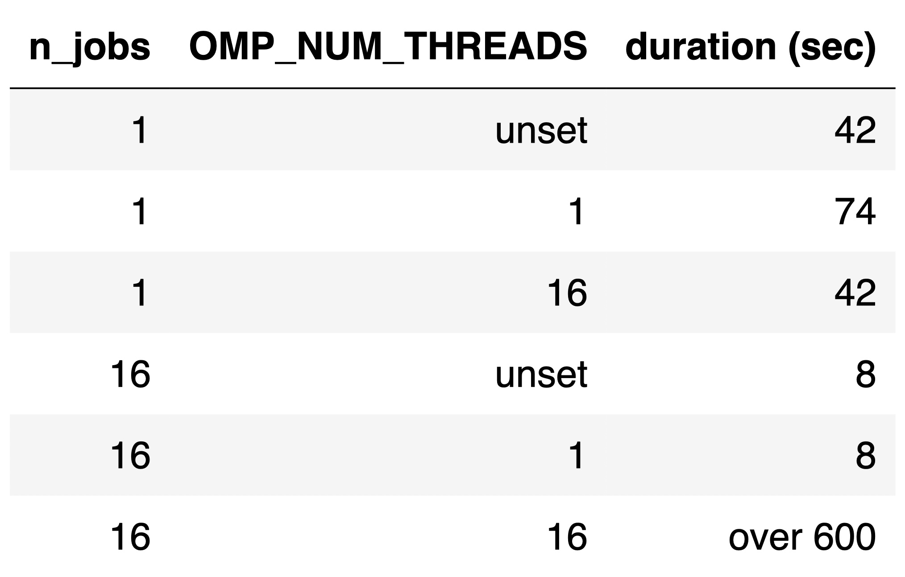

---
# Timing results

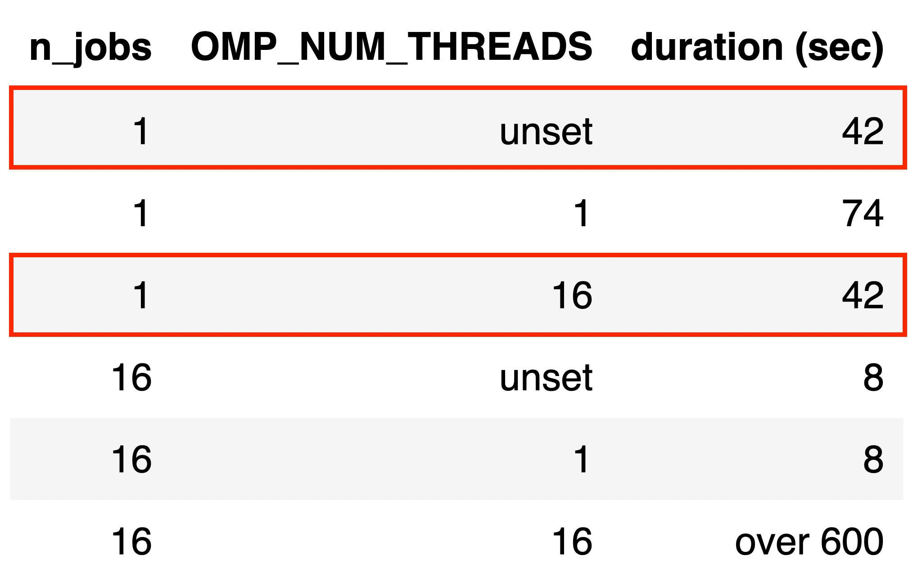

---

# Timing results

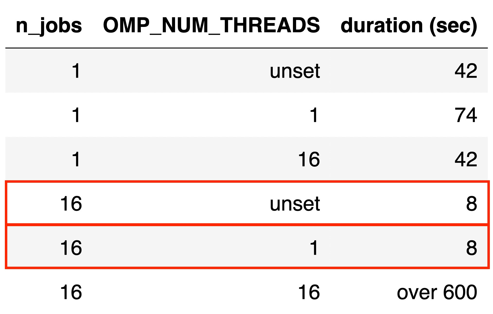

---

# Timing results

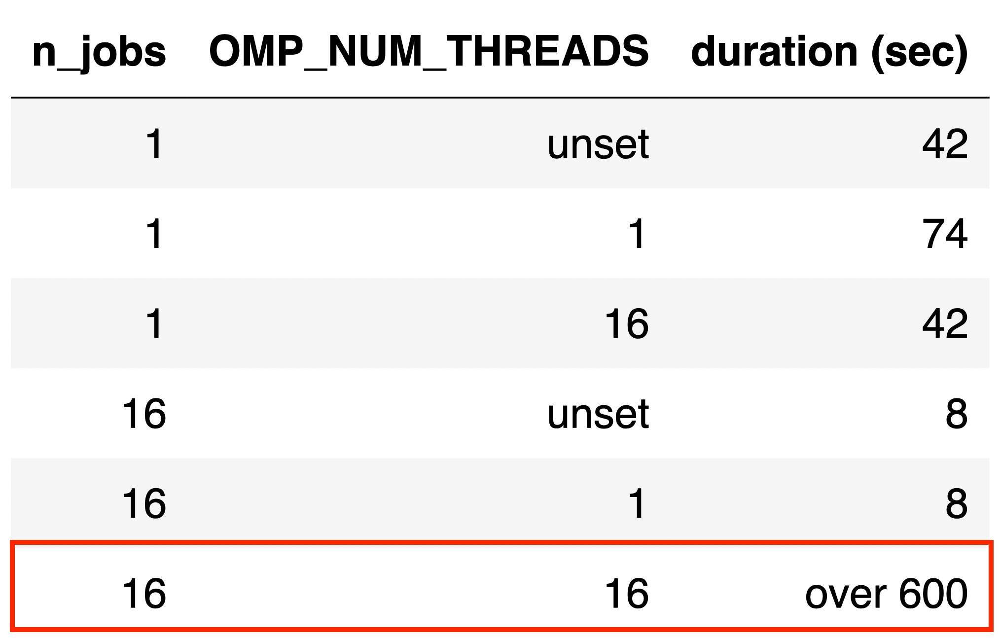

---

class: top

# Dask 

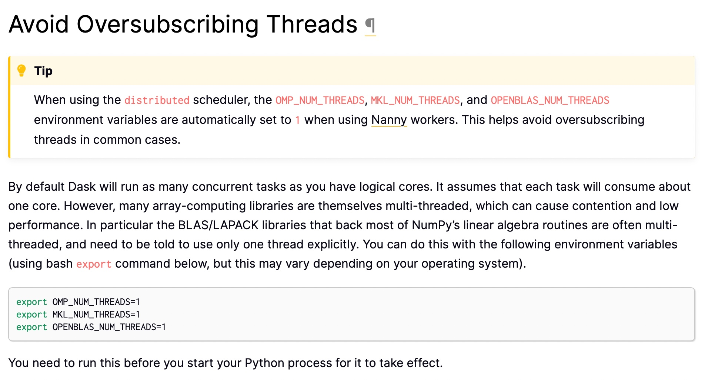

[Source](https://docs.dask.org/en/stable/array-best-practices.html#avoid-oversubscribing-threads)


---


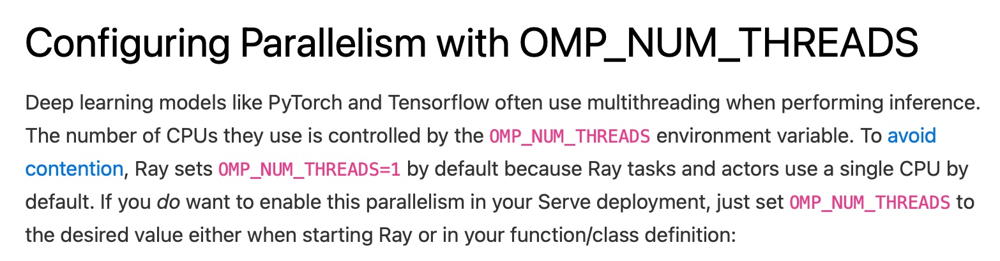

[Source](https://docs.ray.io/en/latest/serve/scaling-and-resource-allocation.html#configuring-parallelism-with-omp-num-threads)

---

class: chapter-slide

# Is there a problem here? 🤔

---

<!--
# Many configuration options 🛠

## Libraries follow a common environment variable

```bash
export GOTO_NUM_THREADS=4
python run_computation.py
```

## Library specific environment variable

```bash
export GOTO_NUM_THREADS=4
export POLARS_MAX_THREADS=8
python run_computation.py
```
 -->

# Using Multiple Parallel APIs
## Native thread libraries 🧵
- OpenBLAS (built with `pthreads`) and code with `OpenMP`
- Poor interactions between `OpenMP` with different compilers
- Two OpenBLAS present (`NumPy` and `SciPy` on `PyPI`)

- Read more at: [thomasjpfan.github.io/parallelism-python-libraries-design/](https://thomasjpfan.github.io/parallelism-python-libraries-design/)

---

# Using Multiple Parallel APIs
## Using more than one parallel backends 🤯

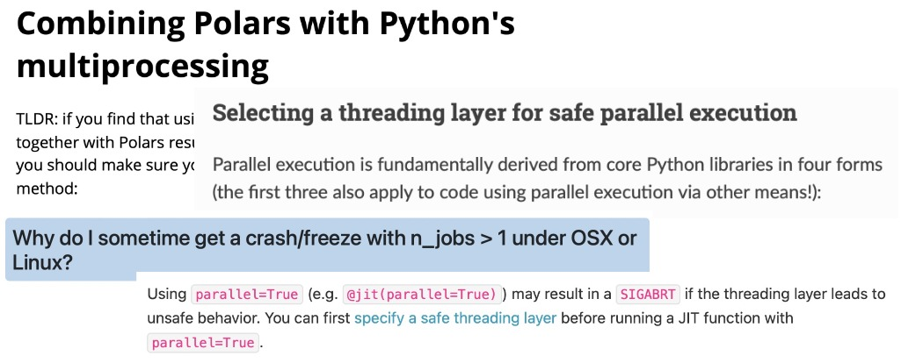

Sources: [polars](https://pola-rs.github.io/polars-book/user-guide/howcani/multiprocessing.html),
[numba](https://numba.pydata.org/numba-doc/latest/user/threading-layer.html),
[scikit-learn](https://scikit-learn.org/stable/faq.html#why-do-i-sometime-get-a-crash-freeze-with-n-jobs-1-under-osx-or-linux),
[pandas](https://pandas.pydata.org/pandas-docs/stable/user_guide/enhancingperf.html#caveats)

---

class: center
# Parallel by Default?

<br>


---

# Conclusion
.g[
.g-6.center[
## Configuration

]
.g-6.center[
## Implementation

]
]

---

.g[
.g-9[
# Configuration Options
- Environment variables:
    - `OMP_NUM_THREADS`, `MKL_NUM_THREADS`, etc
- Global: `torch.set_num_threads`
- Context manager: `threadpoolctl` (BLAS and OpenMP)
- Call-site parameters: `n_jobs`, `worker`
]
.g-3[

]
]

---

.g[
.g-9[
# Implementation Options
- `C`, `C++`, `Numba`, `Rust`, `Python`, etc
- Python Multiprocessing and Multithreading
- Native threads: `OpenMP`, `pthreads`, Intel TBB
]
.g-3[

]
]


---

class: center

# Parallelism in Numerical Python Libraries

.larger[Thomas J. Fan]<br>
@thomasjpfan<br>
<a href="https://www.github.com/thomasjpfan" target="_blank"><span class="icon icon-github icon-left"></span></a>
<a href="https://www.twitter.com/thomasjpfan" target="_blank"><span class="icon icon-twitter"></span></a>


<a class="this-talk-link", href="https://github.com/thomasjpfan/pydata-nyc-2022-parallelism" target="_blank">
This talk on Github: github.com/thomasjpfan/pydata-nyc-2022-parallelism</a>
